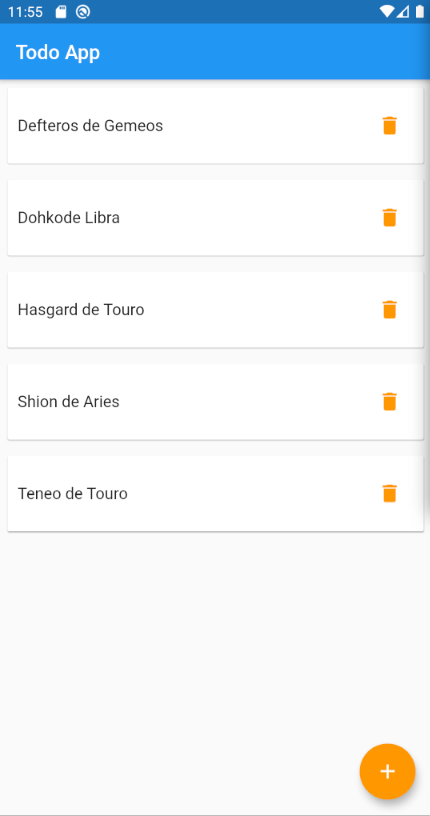

# Todo App

Flutter + Firebase Authentication + Firebase Firestore

## Emulator
```bash
flutter devices
flutter emulators --launch Pixel3A

```

### Run
```bash
flutter run
```
### Docs
- [Lab: Write your first Flutter app](https://flutter.dev/docs/get-started/codelab)
- [Cookbook: Useful Flutter samples](https://flutter.dev/docs/cookbook)
- [online documentation](https://flutter.dev/docs), which offers tutorials,

## Dashboard
